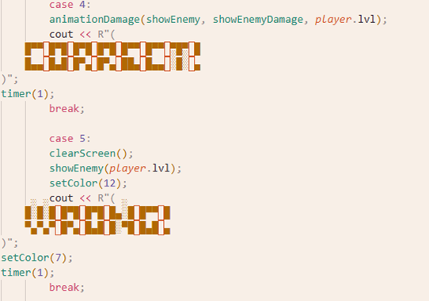
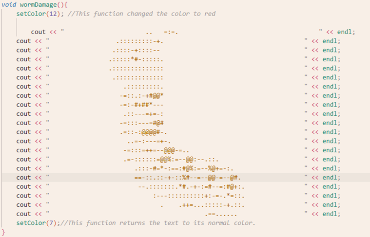
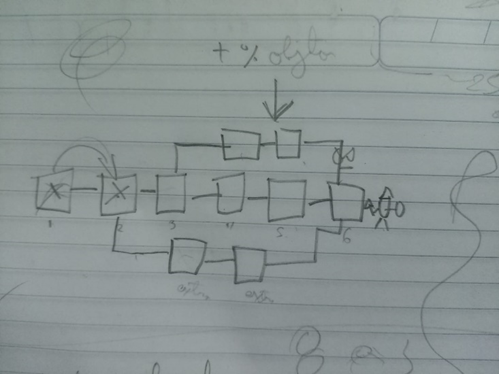
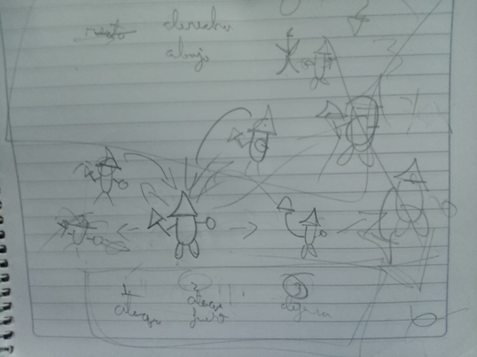
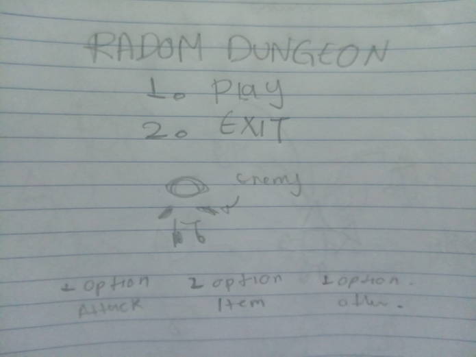

# Proyecto de C++ - Random Dungeon

## Descripción del Proyecto

RANDOM DUNGEON
Temática y Ambientación
Random Dungeon es un juego de aventura y combate ambientado en una serie de calabozos llenos de peligro. En cada nivel, el jugador se enfrenta a enemigos como orcos, caballeros y dragones, cada uno custodiando la salida hacia el siguiente desafío.
Cada calabozo plantea un nuevo entorno y desafío, donde el jugador debe avanzar usando estrategia, atención y un poco de suerte. La progresión por niveles refuerza la sensación de exploración, enfrentando obstáculos cada vez más complejos en un mundo de inspiración medieval y fantástica. El juego combina aventura, combate y toma de decisiones para superar a los jefes y llegar hasta el final.

Mecánica Principal
•	El jugador debe vencer a un enemigo por cada nivel para avanzar.
•	Puede tomar atajos que le permiten llegar más rápido al último nivel o conseguir más objetos (como pociones de vida o mejoras de ataque).
•	Si el jugador se queda sin vida, pierde el juego.
•	Para ganar el jugador debe vencer al enemigo final en el último nivel.
•	Existe una probabilidad de obtener objetos útiles después de cada victoria.
Mecánicas específicas del Juego
1.	Combate por números:
o	Se presentan 3 o 5 números (según el nivel).
o	El jugador elige uno; el enemigo elige al azar.
o	Si ambos eligen el mismo, el jugador recibe daño. Si son diferentes, el enemigo recibe daño.
2.	Piedra, Papel o Tijera (Versión combate):
o	Opciones: Ataque Fuerte, Ataque Débil, Defensa.
o	Reglas similares a piedra-papel-tijera:
	Ataque Fuerte vence a Defensa
	Ataque Débil vence a Ataque Fuerte
	Defensa vence a Ataque Débil
o	El ganador del turno hace daño al otro.
3.	Juego de Memoria:
o	Se muestran varios números aleatorios en pantalla por unos segundos.
o	Luego desaparecen, y el jugador debe escribirlos en el orden correcto.
o	Si lo logra, daña al enemigo; si falla, recibe daño.
o	En cada ronda la secuencia de números se vuelve más larga.
o	Se gana si se logra una cantidad establecida de aciertos.
o	Se pierde si se alcanza una cantidad establecida de fallos.

Idea General de la Jugabilidad
El jugador interactúa con el juego exclusivamente a través del ingreso de números por teclado. No hay controles visuales ni movimientos, solo decisiones numéricas que definen el avance o el resultado de cada encuentro.
•	Juego de un solo jugador, modo texto (consola).
•	Avanza nivel por nivel enfrentando a enemigos.
•	Cada enemigo se derrota a través de una de las tres mecánicas de juego.
•	El jugador tiene una cantidad limitada de vida, que puede recuperar si obtiene objetos.
•	Las mecánicas cambian o se vuelven más difíciles en niveles más altos (por ejemplo, más opciones en los juegos de azar o mayor número de dígitos a memorizar).

Aplicación de Temas Vistos en Clase
Variables y Tipos de Datos
A lo largo del desarrollo del juego se utilizaron diferentes tipos de variables para representar los datos esenciales del jugador, los enemigos y la lógica de las mecánicas.
Las variables de tipo int se usaron para representar opciones del menú, acciones del jugador, valores de vida, daño, niveles, y también para guardar los números que el jugador ingresa durante el juego.
•	int enemyAction, action;
•	
•	    enemyAction = randomNum(1, 3);

Las variables bool fueron útiles para controlar ciertos estados, como por ejemplo si un jugador continúa dentro de un menú, si ya ha ganado una ronda, o si se debe repetir una mecánica.
•	void principalMenu(){
•	    bool menu = true;

También se usaron otros tipos como string y arreglos int[] para manejar secuencias en el juego de memoria.
•	void numsMemo(int max, int goal, int attempts, Player& player, Enemy& enemy) {
•	    int nums[10] = {0}, fails = 0, successes = 0;
•	    string code, playerCode;

Estructuras Condicionales (if, else, switch)
Las sentencias if y else se usaron para validar entradas del jugador, como asegurarse de que los valores ingresados estén dentro de un rango permitido. Por ejemplo, si el jugador debía elegir un número entre 1 y 3, se verificaba que no ingresara valores fuera de ese rango.
•	if (playerNum < 0 || playerNum > max)
•	    {
•	        firstGame(4, player);
•	        numCombat(max, player, enemy);
•	        return;
•	    }

También se usaron para la lógica del combate, por ejemplo, si el número elegido por el jugador coincide con el del enemigo, el jugador recibe daño; si no, el enemigo es el que recibe el daño.
•	else
•	    {
•	        if (num[0] == playerNum || num[1] == playerNum)
•	        {
•	            firstGame(5, player);
•	            player.getDamage(enemy);
•	        }
•	        else
•	        {
•	            firstGame(6, player);
•	            enemy.getDamage(player);
•	        }
•	    }

En los objetos aleatorios, se utilizó if para verificar si un número aleatorio coincide con un valor específico, lo que determinaba si el jugador obtenía un objeto o no.
•	 if (randomNum(1,2) == 1)
•	            {
•	                cout<<"You win a max life increase"<<endl;
•	                player.lifeMax += 1;
•	                win++;
•	            }
•	            if (randomNum(1,4) == 1)
•	            {
•	                cout<<"You win a damage increase"<<endl;
•	                player.damage += 1;
•	                win++;
•	            }
•	
Por otro lado, la estructura switch fue útil en:
La navegación por los diferentes menús del juego (como el menú de inicio o las opciones dentro de cada nivel).
•	 switch (option)
•	        {
•	        case 1:
•	            playEnemyAttack(enemy.mecanic, parameters, size, player, enemy);
•	            break;
•	        case 2:
•	            player.useItem();
•	            break;
•	        case 3:
•	            save(player);
•	            exit(0);
•	            break;
•	        default:
•	            cout<<"It isn't a valid option"<<endl;
•	            break;
•	        }

En funciones como playEnemyAttack y rockPaperScisors, donde el valor pasado determina qué tipo de mecánica se ejecuta o qué acción realiza el enemigo:
•	void playEnemyAttack(int mecanic, int parameters[], int size, Player& player, Enemy& enemy){
•	    switch (mecanic)
•	    {
•	    case 1:
•	        numCombat(parameters[0], player, enemy);
•	        break;
•	    case 2:
•	        numsMemo(parameters[0], parameters[1], parameters[2], player, enemy);
•	        break;
•	    case 3:
•	        rockPaperScisors(player, enemy);
•	        break;    
•	    default:
•	        break;
•	    }
•	}

También se implementó switch en funciones dedicadas a mostrar elementos visuales en consola. Estas funciones reciben parámetros numéricos y, mediante estructuras switch, determinan qué texto, diseño o personaje mostrar en pantalla. Cada valor representa una escena específica, un enemigo o un mensaje personalizado que forma parte de la interfaz del usuario.
•	void showEnemy(int playerLevel){
•	    switch (playerLevel) {
•	    case 1: worm(); break;
•	    case 2: spider(); break;
•	    case 3: dragon(); break;
•	    case 4: slime(); break;
•	    case 5: snake(); break;
•	    case 6: knight(); break;
•	    case 7: orc(); break;
•	    case 8: snake(); break;
•	    case 9: mouse(); break;
•	    case 10:orc(); break;
•	}

Ciclos (for, while, do while)
El ciclo for se utilizó, por ejemplo, en la mecánica del juego de memoria, se genera una secuencia de números aleatorios que el jugador debe memorizar. El ciclo for se usa para crear y mostrar esta secuencia número por número, asegurando que la longitud de la secuencia se adapte al nivel de dificultad. También se emplea para controlar la cuenta regresiva que indica al jugador cuánto tiempo tiene para memorizar los números antes de que desaparezcan de la pantalla.
•	    for (int i = 0; i < max; i++) {
•	            nums[i] = randomNum(1, 9);
•	            code += to_string(nums[i]);
•	        }
•	        cout << code << endl;
•	
•	        secondGame(2, player);
•	        for (int j = 5; j >= 0; j--) {
•	            cout << j << " " << flush;
•	            timer(1);
•	        }

Ambos ciclos while y do while se utilizaron para mantener la ejecución continua de distintas partes del juego mientras se cumplan ciertas condiciones.
Por ejemplo, durante la selección de acciones del jugador en combate, el menú permanecerá visible y activo hasta que el jugador o el enemigo pierdan toda su vida. También se usa en la mecánica de memoria para repetir la generación y validación de secuencias hasta que el jugador alcance la cantidad de aciertos necesarios o agote sus intentos.
•	do
•	    {   
•	        timer(1);
•	        clearScreen();
•	        cout<<"Select an option"<<endl;
•	        cout<<"1. Fight\n2. Use potion "<<player.items<<"\n3. Exit"<<endl;
•	        cout<<endl;
•	        cout<<"Life: "<<player.life<<"/"<<player.lifeMax<<"       Enemy life: "<<enemy.life<<endl;
•	        cout<<"Damage: "<<player.damage<<"       Enemy damage: "<<enemy.damage<<endl;
•	        cin>>option;
•	        cinControl();
•	
•	        switch (option)
•	        {
•	        case 1:
•	            playEnemyAttack(enemy.mecanic, parameters, size, player, enemy);
•	            break;
•	        case 2:
•	            player.useItem();
•	            break;
•	        case 3:
•	            save(player);
•	            exit(0);
•	            break;
•	        default:
•	            cout<<"It isn't a valid option"<<endl;
•	            break;
•	        }
•	    }while (player.alive() && enemy.alive());    
•	}
•	

Funciones
•	Funciones de mecánicas de juego: Cada una de las tres mecánicas principales (azar, memoria, piedra-papel-tijeras) tiene su propia función dedicada, donde se controla la lógica de esa mecánica, la interacción del jugador, y el impacto en el combate.
•	Funciones de menús: Para manejar la interacción del jugador con el juego, como seleccionar opciones de inicio, escoger acciones durante el combate, o navegar entre niveles.
•	Funciones de combate: Incluyen métodos para calcular daño recibido y causado, tanto para el jugador como para el enemigo. 
•	Funciones para la gestión de items: Permiten al jugador usar objetos que restauran vida o mejoran atributos, controlando la cantidad de ítems disponibles y su efecto.
•	Funciones para la interfaz y animaciones: Estas funciones manejan la presentación en pantalla, como mostrar animaciones de daño, actualizar el estado visual de enemigos y personajes, y mostrar textos con formato especial según la situación.
•	Funciones generadoras de enemigos: Se encargan de crear enemigos con parámetros específicos de vida, ataque y mecánica, ajustando la dificultad de cada nivel.
Algunos ejemplos de funciones:
•	void Player::useItem(){
•	    if (items != 0)
•	    {
•	        life++;
•	        if (life > lifeMax) life = lifeMax;        
•	        items--;
•	    }
•	    else cout<<"You haven't items to use"<<endl;
•	}

•	Enemy generateEnemy(int life, int attack, int mechanic){
•	    Enemy enemy = {life, attack, mechanic};
•	    return enemy;
•	}
•	

Interfaz por Consola
Para ofrecer una experiencia atractiva pese a ser un juego en consola, se implementaron varias técnicas:
•	Arte ASCII: Se diseñaron gráficos con caracteres para representar enemigos, personajes y elementos del juego, dándole personalidad y estilo visual único.
•	Pantallas de carga: Se usan para suavizar el paso entre niveles o escenas, evitando que el cambio sea abrupto.
•	Colores en texto y gráficos: Se implementó la modificación del color de textos y caracteres ASCII para indicar daño recibido.
•	Textos dinámicos y diseños: Los textos de menús y combates se presentan con formatos y estilos acordes a la temática, haciendo la interacción más agradable y clara.

Estructuras de Datos
En este proyecto se utilizaron estructuras (struct) para representar a los personajes del juego: el jugador y los enemigos. Cada estructura contiene tanto datos como funciones asociadas, lo que permite organizar y manipular fácilmente el comportamiento de cada entidad.
•	La estructura Player almacena atributos como la vida actual y máxima, el daño, el número de ítems disponibles, y el nivel. Además, incluye funciones para recibir daño, usar objetos, aumentar estadísticas y verificar si sigue con vida.
•	La estructura Enemy contiene la vida, el daño que puede causar, y el tipo de mecánica que utiliza en combate. También tiene funciones para atacar, recibir daño, comprobar si está vivo y ejecutar su mecánica de ataque.
•	struct Player
•	{
•	    int life = 3;
•	    int lifeMax = 3;
•	    int damage = 1;
•	    int items = 0;
•	    int lvl = 1;
•	
•	    //Player functions 
•	    void getDamage(const Enemy& enemy);
•	
•	    void useItem();
•	
•	    void addItem();
•	
•	    void increaseAttack();
•	
•	    int attack() const;
•	
•	    bool alive() const;
•	};
•	

•	struct Enemy
•	{
•	    int life = 0;
•	    int damage = 0;
•	    int mecanic = 0;
•	
•	    //Enemies function
•	    void getDamage(const Player& player);
•	    int attack() const;
•	    bool alive() const;
•	    void playEnemyMecanic(int mecanic);
•	};

Manejo de Archivos
El juego incluye una funcionalidad de guardado y carga de partida mediante el uso de archivos .txt. Esta característica permite al jugador continuar su progreso en sesiones futuras.
•	La función save() guarda el estado del jugador (vida, vida máxima, daño, ítems y nivel) en un archivo temporal (temp.txt). Luego, este archivo reemplaza al archivo principal de datos (data.txt) si la escritura fue exitosa.
•	La función load() intenta leer los datos del jugador desde data.txt. Si el archivo existe y tiene un formato válido, los datos se cargan en la estructura del jugador. En caso de que el archivo no exista, se crea automáticamente usando la función save().
•	//Save game
•	void save(Player& player)
•	{
•	    ofstream temp("temp.txt");
•	    bool saved = false;
•	    if (temp.is_open())
•	    {
•	        temp<<player.life<<" "<<player.lifeMax<<" "<<player.damage<<" "<<player.items<<" "<<player.lvl<<endl;
•	        saved = true;
•	    }
•	    temp.close();
•	    if (saved)
•	    {
•	        remove("data.txt");
•	        rename("temp.txt", "data.txt");
•	        cout<<"SAVED"<<endl;
•	    }
•	    else
•	    {
•	        cout<<"SAVE ERROR"<<endl;
•	    }
•	}
•	//Load game
•	void load(Player& player)
•	{
•	    ifstream file("data.txt");
•	
•	    if (file.is_open())
•	    {
•	        int life, lifeMax, damage, items, lvl;
•	
•	        if (file >> life >> lifeMax >> damage >> items >> lvl)
•	        {
•	            player = {life, lifeMax, damage, items, lvl};
•	            cout<<"LOAD"<<endl;
•	        }
•	        else
•	        {
•	            cout << "LOAD ERROR: Invalid file format" << endl;
•	        }
•	
•	        file.close();
•	    }
•	    else
•	    {
•	        save(player);
•	    }
•	}

Manejo de Errores
El juego incluye manejo básico de errores a través de validaciones en la entrada del usuario.
Por ejemplo:
•	Se verifica que el jugador no ingrese valores fuera del rango esperado en menús o mecánicas.
•	Si el jugador ingresa un dato no numérico, se limpia el flujo de entrada y se repite la solicitud.
•	Se controlan situaciones como intentar usar un ítem cuando no se tienen disponibles, mostrando un mensaje informativo en lugar de provocar un error en el programa.
Estas medidas aseguran que el juego funcione de manera estable, incluso si el jugador comete errores al ingresar datos.
•	//Control in case imput != number
•	bool cinControl(){
•	    if (cin.fail()) {
•	            cin.clear();
•	            cin.ignore(numeric_limits<std::streamsize>::max(), '\n');
•	            cout << "It isn't a valid option"<<endl;
•	            return true;
•	        }
•	    else return false;
•	}

Consideraciones Técnicas del Desarrollo
•	El juego fue desarrollado en C++ utilizando el entorno de desarrollo Visual Studio Code.
•	Se utilizaron únicamente librerías estándar y del sistema, sin depender de bibliotecas externas. Algunas de las más importantes fueron:
o	iostream: para entrada y salida estándar.
o	fstream: para manejo de archivos.
o	cstdlib, random: para generación de números aleatorios.
o	thread, chrono: para manejo de tiempos, animaciones simples y temporizadores.
o	unistd.h: para compatibilidad con sistemas Unix/Linux.
o	windows.h: para comandos específicos de Windows (por ejemplo, control de color en la consola).
•	El proyecto está estructurado con un archivo principal main.cpp y una carpeta src/ que contiene los módulos del juego. Cada módulo está dividido en un archivo .h para las declaraciones de funciones y un archivo .cpp para su implementación.
•	El juego se ejecuta exclusivamente en consola, sin interfaz gráfica avanzada. Por esta razón, se desarrolló una interfaz visual usando arte ASCII, simulando animaciones, personajes y pantallas de combate.
•	Es compatible con Windows y Linux. En Linux puede compilarse directamente in ningún requisito de instalación. En Windows, es necesario instalar previamente un compilador compatible como MinGW o MSYS2, que incluya g++, para poder compilar y ejecutar el código correctamente con g++ -std=c++17. 
•	El juego es para un solo jugador y se centra en avanzar a través de niveles derrotando enemigos con distintas mecánicas.
•	Un desafío importante fue la compatibilidad entre sistemas operativos, ya que el desarrollo se realizó en paralelo entre Windows y Linux. Fue necesario adaptar ciertas instrucciones, como la limpieza de pantalla o el cambio de color en textos, para asegurar el mismo comportamiento en ambos entornos.

Mockups del juego

## Equipo

- **Nombre del equipo:** c--

### Integrantes del equipo

1. **Nombre completo:** Merlin Rosmery Campos Merlos
   **Carnet:** 00020725

2. **Nombre completo:** Carlos Daniel Martinez Rojas   
   **Carnet:** 00032225

## Instrucciones de Ejecución

Clona este repositorio en tu máquina local:

git clone [URL del repositorio]

Abre la carpeta del proyecto en Visual Studio Code (u otro editor de tu preferencia).
Se recomienda usar Visual Studio Code por compatibilidad y facilidad de uso en Windows.

Asegúrate de tener instalado un compilador de C++, como MinGW o MSYS2, que incluya g++.
También puedes compilar en sistemas Linux directamente si ya tienes g++.

Abre la terminal en Visual Studio Code (o una terminal externa).

Compila el programa usando el siguiente comando (asegúrate de estar en la raíz del repositorio):

g++ -std=c++17 src/Combat.cpp src/EnemiesMecanic.cpp src/Enemy.cpp src/Game.cpp src/Items.cpp src/Level.cpp src/Player.cpp src/UI.cpp src/Utilities.cpp main.cpp -o main

"main" es el nombre del ejecutable, puedes usar otro nombre 
Ejecuta el programa escribiendo:

./main 
(nombre del ejecutable, en este caso main)
En Windows puede que necesites escribir main.exe en lugar de ./main.

Y ya podras disfrutar de la experiencia de juego !

## Explicación del funcionamiento del juego

El flujo del juego se controla principalmente mediante funciones que gestionan los niveles, combates y la transición entre estados del jugador (vida, progreso, guardado, etc.). A continuación, se describe cómo trabaja el código:

1. Inicio del juego y niveles
El juego se inicia desde un menú principal, y dependiendo del modo (normal o infinito), se llama a levelSelector o infiniteLevels.

La función levelSelector(int lvl, Player& player) evalúa el número de nivel actual y ejecuta la lógica correspondiente.

En cada nivel, se define:

El enemigo (generateEnemy(...))

La mecánica de combate (combatMenu(...))

Cada vez que el jugador entra en una batalla, se llama a la función combatMenu, que:

Muestra información del jugador y enemigo (secondMenu).

Pide al jugador elegir una acción:

1: Enfrentar al enemigo usando la mecánica del nivel.

2: Usar un objeto de inventario.

3: Salir del juego.

Dependiendo de la elección, se llama a playEnemyAttack o se activa el uso de ítems.

El combate se repite en bucle (do-while) hasta que uno de los dos (jugador o enemigo) muere.

3. Mecánicas de combate (playEnemyAttack)
Esta función selecciona la mecánica de combate que usará el enemigo, según su tipo:

case 1: numCombat — Combate por selección de número.

case 2: numsMemo — Juego de memoria con secuencias.

case 3: rockPaperScisors — Versión de piedra, papel o tijera.

4. Transición entre niveles (nextLevel)
Después de cada combate, nextLevel determina qué ocurre:

Si el jugador pierde (!playerAlive): se reinicia y vuelve al menú.

Si gana (!enemyAlive): sube de nivel, recibe premios y guarda progreso.

En modo infinito: el jugador recibe un nivel aleatorio y se acumulan estadísticas especiales (player.infinite).

 5. Rutas alternativas y atajos (useShortcut)
Algunos niveles ofrecen rutas rápidas (por ejemplo, del nivel 2 al 7). Si el jugador elige tomarlas, puede avanzar más rápido. La función useShortcut se encarga de manejar estas decisiones.

 6. Modo infinito (infiniteLevels)
Este modo genera niveles sin fin con enemigos y parámetros aleatorios. Se usa en combinación con randomNum(...) para variar la dificultad. Sirve como un desafío de resistencia o puntuación alta, y se guarda el progreso por separado con infiniteSave.

